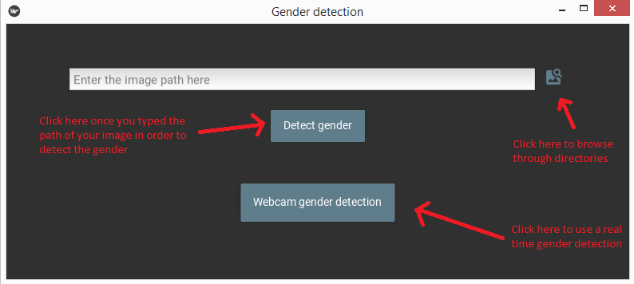
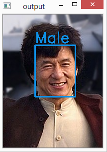
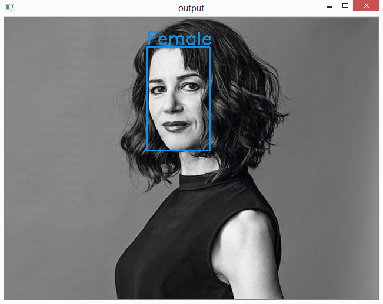
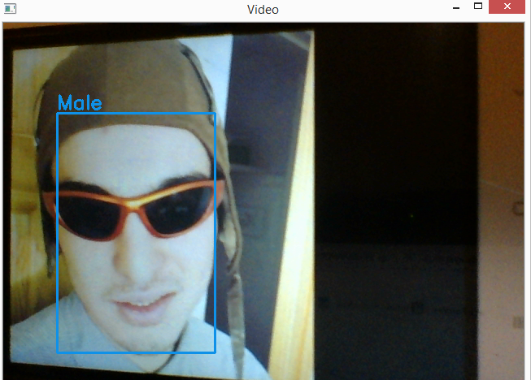

# Gender detection KIVY app

The model was trained using the [UTKFace dataset](https://susanqq.github.io/UTKFace/) and the following [image classificator](https://github.com/rohanpillai20/Image-Classification-by-Keras-and-Tensorflow). If you don't want to train your own model you can download the one I used [here](https://github.com/Matabufalez/gender-detection-KIVY/releases/download/v1.0/model.h5) as well as the [model weights](https://github.com/Matabufalez/gender-detection-KIVY/releases/download/v1.0/weights.h5) (they must be placed in the main.py directory).
If you're interested only in the gender detection code without any the KIVY stuff you can see it in the "gender detection code" folder.

## Requeriments
- kivy
- kivymd
- keras
- tensorflow
- opencv-python
- cvlib
- numpy

## Usage

On command prompt:

`python main.py`

## Examples

